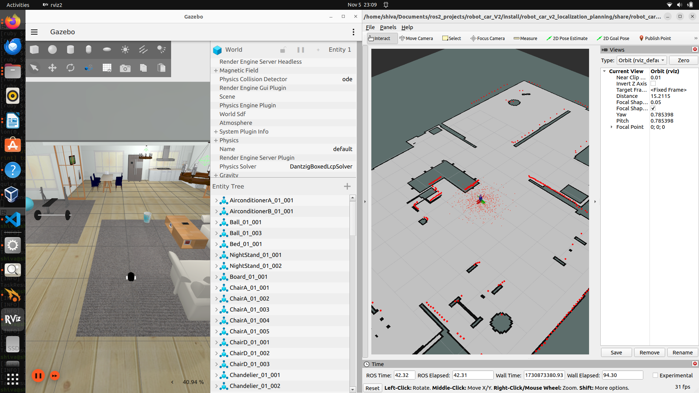
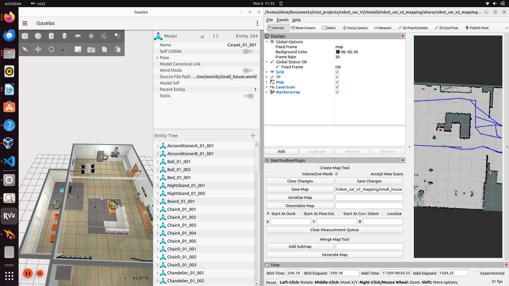
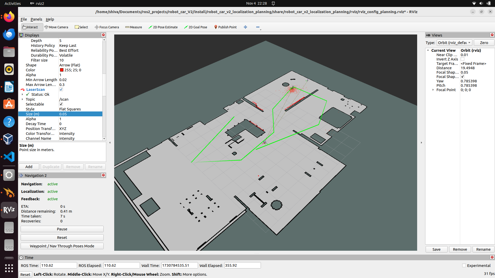

# Robot Car: Localization and Mapping with Adaptive Monte Carlo Localization, SLAM, and Twist Mux Integration

This project builds on the previous robot car design, implementing advanced localization and mapping techniques. Initially tested with wheel odometry and probabilistic methods, the system was enhanced using Adaptive Monte Carlo Localization (MCL) and the ROS Navigation Stack (Nav Stack) integrated with SLAM. Additional functionality includes Twist Mux for relaying command velocities based on priority, enabling joystick-based control during mapping. The Waypoint Navigator was added to allow precise navigation to specified locations. A Lifecycle Node and Manager was implemented for smooth project state transition, allowing users to switch between mapping, localization, and planning modes via command line. These features were tested in multiple Gazebo environments, including an AWS house, warehouse, and custom world.


## Installation

**Prequisites**

* Ubuntu 22.04 LTS

* ROS2 humble

* Gazebo

**Step 1: Install ROS 2 Humble** 

Follow the [ROS 2 Humble installation](https://docs.ros.org/en/humble/Installation.html) instructions for your operating system if ROS 2 is not already installed.

**Step 2: Install Required ROS 2 Packages** 

Install the necessary ROS 2 packages.
```bash
sudo apt-get install ros-humble-ros2-control
sudo apt-get install ros-humble-ros2-controllers
sudo apt-get install ros-humble-xacro
sudo apt-get install ros-humble-ros-gz-*
sudo apt-get install ros-humble-*-ros2-control
sudo apt-get install ros-humble-joint-state-publisher-gui
sudo apt-get install ros-humble-turtlesim
sudo apt-get install ros-humble-robot-localization
sudo apt-get install ros-humble-joy
sudo apt-get install ros-humble-joy-teleop
sudo apt-get install ros-humble-tf-transformations


```
**Step 3: Install Python Packages** 

Install Python and additional packages:
```bash
sudo apt-get install python3-pip
pip install transforms3d
```
**Step 4: Additional Packages for Hardware Communication** 

To enable communication between the Arduino and ROS 2 using the Serial protocol:
```bash
sudo apt-get install libserial-dev
```

## Run Locally

Clone the project

```bash
  git clone git@github.com:shivasamkumar/AGV_Kalman_Filter_Robot.git
```

Go to the project directory

```bash
  cd robot_car_v2
```

build the project

```bash
  colcon build 
```

Source your workspace

```bash
  source /opt/ros/humble/setup.bash
  source ~/workspace/install/setup.bash 
```

Launch the project

```bash
  ros2 launch robot_car_v2_bringup robot_car.launch.py use_slam:=false world_name:=small_house
```

---
**NOTE**

* For mapping use_slam := True 

* if using a different map for localization and planning specify it using map_name:= ... as the launch argument 

* Maps and world files with models for each scenarios have been attached in the code hub 


---


## Demo



The visulation of localization algorithm (creating voxel grid maps)



This image shows how to save the map using slam toobox


Waypoints created with the global trajectory.

**Video**

This demo shows the Mapping algorithm and the planning through rviz.The user first creates a map of the environment by controlling the robot car through joystick and then using the saved mad to localize and plannining. This project is digital twin and can deployed to external hardware (Rasberry pi) with slight modifications.

I have posted video in 3x speed !

**click on the image for the video**

[](https://drive.google.com/file/d/19Vll6FrYRwy6NWjy_z7juxf_BR87-VF_/view?usp=sharing)


**click on the image for the video**

This video shows the mapping in the Warehouse environment.

I have posted video in 3x speed !

[](https://drive.google.com/file/d/19THgAcLc1siC2gttrrNZ2ROxX0wCCSBm/view?usp=drive_link)


## Future versions 
* **Web-Based GUI**

    Integrating a web-based control interface for remote access and operation, enabling users to control the robot arm from any device with internet access.

* **Hardware Integration**
